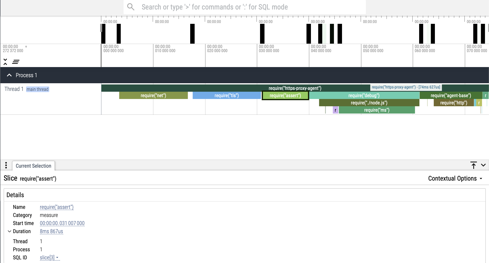

# breqd

**B**uiltin modules **REQ**uire **D**urations

This library measures the duration of `require()` on Node.js' builtin modules.

## Usage

### CLI usage

```js
$ npx breqd
...
  { moduleName: 'tty', duration: 3822 },
  { moduleName: 'diagnostics_channel', duration: 3410 },
  { moduleName: 'url', duration: 3151 }
]
File generated by breqd: breqd-node-v20.17.0-darwin-x64.json
Open it on https://ui.perfetto.dev!
```

Opening the generated file on <https://ui.perfetto.dev> looks like this.


### Programmatic usage

```ts
import {
  ModuleDurationsMap,
  ModuleDuration,
  getModuleDurations,
  sortModuleDurations,
} from 'breqd';

const moduleDurations: ModuleDurationsMap = getModuleDurations();

const sortedModuleDurations: ModuleDuration[] = sortModuleDurations(moduleDurations);

console.log(sortedModuleDurations);
// [
//   { moduleName: 'repl', duration: 4989944 },
//   { moduleName: 'assert', duration: 3411434 },
//   { moduleName: 'http2', duration: 2925764 },
//   ...
// ]
```

## API

### `getModuleDurations()`

- Returns `ModuleDurationsMap`:
  - `index` (**string**) - The module name.
  - value (**number**) - The duration of `require()` on the module in nanoseconds.

Measures the duration of `require()` on all builtin modules of the running Node.js process and returns it.

### `sortModuleDurations()`

- `moduleDurations` (**ModuleDurationsMap**) - The module-duration object from `getModuleDurations()`.
- Returns `ModuleDuration[]`:
  - `moduleName` (**string**) - The module name.
  - `duration` (**number**) - The duration of `require()` on the module in nanoseconds.

Returns a sorted array of all the builtin module `require()` durations in descending order of durations.

### `convertModuleDurationstoTEF()`

- `moduleDurations` (**ModuleDuration[]**) - The module-duration object from `sortModuleDurations()`.
- Returns `TEF[]`:
  - `name` (**string**) - The builtin module name.
  - `cat` (**string**) - The event category.
  - `ph` (**string**) - The event type.
  - `pid` (**number**) - The process ID.
  - `ts` (**number**) - The tracing clock timestamp of the event.
  - `dur` (**number**) - The duration of `require()` on the module in microseconds.

Converts the sorted array of all the builtin module `require()` durations into Chrome's [Trace Event Format](https://docs.google.com/document/d/1CvAClvFfyA5R-PhYUmn5OOQtYMH4h6I0nSsKchNAySU/preview#heading=h.yr4qxyxotyw), so that it can be viewed on <https://ui.perfetto.dev>.

## Why does it matter?

It matters if you care about startup performance, like in your Electron app where you might be `require()`-ing a number of Node.js modules during startup. For example:

The [`https-proxy-agent`](https://www.npmjs.com/package/https-proxy-agent) module has over 65M weekly downloads and it takes ~75ms to `require()` v7.0.5 on my Intel macOS Sonoma 14.6.1 running Node.js v20.17.0. ~43ms, i.e., 57% of the total module loading time is spent in requiring just Node.js' own builtin modules! Wouldn't it be great to see this get improved?



The visualization has been generated by using the [perftrace](https://github.com/RaisinTen/perftrace) project.

## License

[MIT](LICENSE)
