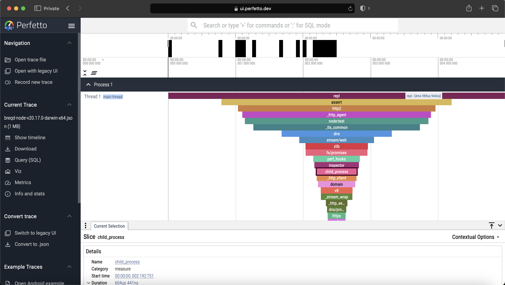

# breqd

**B**uiltin module **REQ**uire **D**urations.

This library measures the duration of `require()` on Node.js' builtin modules.

## Usage

### CLI

```js
$ npx breqd
...
  { moduleName: 'tty', duration: 3822 },
  { moduleName: 'diagnostics_channel', duration: 3410 },
  { moduleName: 'url', duration: 3151 }
]
File generated by breqd: breqd-node-v20.17.0-darwin-x64.json
Open it on https://ui.perfetto.dev!
```

Opening the generated file on <https://ui.perfetto.dev> looks like this.



### Programmatic usage

```ts
import {
  ModuleDurationsMap,
  ModuleDuration,
  getModuleDurations,
  sortModuleDurations,
} from '.';

const moduleDurations: ModuleDurationsMap = getModuleDurations();

const sortedModuleDurations: ModuleDuration[] =
  sortModuleDurations(moduleDurations);

console.log(sortedModuleDurations);
// [
//   { moduleName: 'repl', duration: 4989944 },
//   { moduleName: 'assert', duration: 3411434 },
//   { moduleName: 'http2', duration: 2925764 },
//   ...
// ]
```
